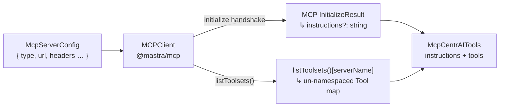
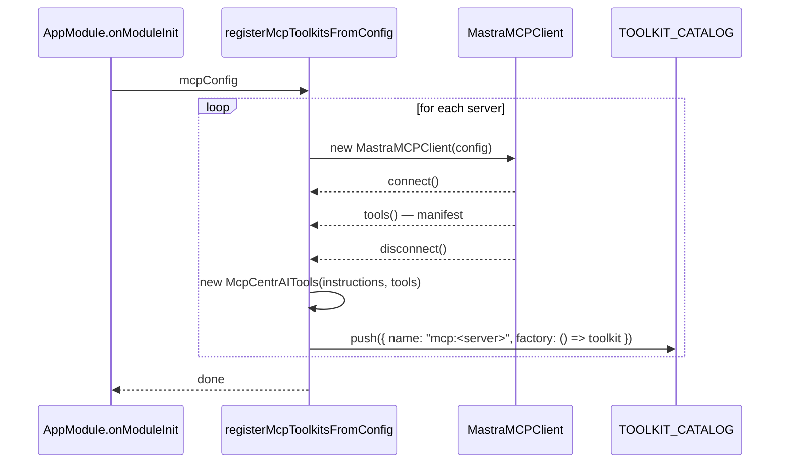

# MCP (Model Context Protocol) — `@centrai/agent`

MCP is the open protocol that lets agents call tools served by external processes over a standardised transport. CentrAI-Chat supports MCP at two levels:

- **Workspace level** — `.mcp.json` configures MCP servers for the Cursor IDE (AI-assisted development).
- **Agent runtime level** — `packages/agent` converts MCP server definitions into Mastra tools and registers them in the `ToolProviderRegistry` / `TOOLKIT_CATALOG`.

This document covers both levels, plus all types, schemas, and integration patterns.

> **Related docs**
> - [`packages/agent/docs/architecture.md`](../packages/agent/docs/architecture.md) — full tool pipeline (AgentToolRef → catalog → registry → Mastra Agent)
> - [`packages/agent/docs/README.md`](../packages/agent/docs/README.md) — package overview

---

## Table of Contents

1. [McpServerConfig schema](#1-mcpserverconfig-schema)
2. [McpConfigFile — `.mcp.json` shape](#2-mcpconfigfile--mcpjson-shape)
3. [Transport types](#3-transport-types)
4. [MCP definition → MCP tool](#4-mcp-definition--mcp-tool)
5. [McpCentrAITools — toolkit wrapper](#5-mcpcentraitools--toolkit-wrapper)
6. [ToolProviderRegistry — individual MCP tools](#6-toolproviderregistry--individual-mcp-tools)
7. [TOOLKIT_CATALOG — whole-server toolkits](#7-toolkit_catalog--whole-server-toolkits)
8. [registerMcpToolkitsFromConfig — startup wiring](#8-registermcptoolkitsfromconfig--startup-wiring)
9. [CENTRAI_CONTEXT_VAR — predefined template variables](#9-centrai_context_var--predefined-template-variables)
10. [Dynamic agent instructions](#10-dynamic-agent-instructions)
11. [AgentToolRef naming convention](#11-agentoolref-naming-convention)
12. [Workspace MCP servers — `.mcp.json`](#12-workspace-mcp-servers--mcpjson)
13. [File layout](#13-file-layout)
14. [Public API reference](#14-public-api-reference)

---

## 1. McpServerConfig schema

Defined in `packages/agent/src/mcp/mcp-server-config.ts`. Uses a **discriminated union** on `type` to model the three standard MCP transports.

```ts
import { z } from 'zod';

// ── Streamable HTTP ──────────────────────────────────────────────────────────
export const mcpStreamableHttpConfigSchema = z.object({
  type: z.literal('streamable-http'),
  /** MCP server endpoint URL. */
  url: z.string().url(),
  /** Auth and routing headers. Template vars ({{VAR}}) resolved by the caller. */
  headers: z.record(z.string()).optional(),
  /** Request timeout in milliseconds. Defaults to 30 000. */
  timeout: z.number().int().positive().optional(),
  /** Fetch and surface the server's own tool instructions. */
  serverInstructions: z.boolean().optional(),
  /** Connect automatically on startup. */
  startup: z.boolean().optional(),
});

// ── SSE ─────────────────────────────────────────────────────────────────────
export const mcpSseConfigSchema = z.object({
  type: z.literal('sse'),
  url: z.string().url(),
  headers: z.record(z.string()).optional(),
  timeout: z.number().int().positive().optional(),
});

// ── Stdio ────────────────────────────────────────────────────────────────────
export const mcpStdioConfigSchema = z.object({
  type: z.literal('stdio'),
  /** Executable to launch (e.g. `"npx"`, `"python"`). */
  command: z.string().min(1),
  /** CLI arguments passed to the command. */
  args: z.array(z.string()).optional(),
  /** Extra environment variables merged into the child process env. */
  env: z.record(z.string()).optional(),
});

// ── Union ────────────────────────────────────────────────────────────────────
export const mcpServerConfigSchema = z.discriminatedUnion('type', [
  mcpStreamableHttpConfigSchema,
  mcpSseConfigSchema,
  mcpStdioConfigSchema,
]);

export type McpServerConfig = z.infer<typeof mcpServerConfigSchema>;
export type McpStreamableHttpConfig = z.infer<typeof mcpStreamableHttpConfigSchema>;
export type McpSseConfig = z.infer<typeof mcpSseConfigSchema>;
export type McpStdioConfig = z.infer<typeof mcpStdioConfigSchema>;
```

---

## 2. McpConfigFile — `.mcp.json` shape

The top-level file schema. The key is the **server name** used to reference the server everywhere else.

```ts
export const mcpConfigFileSchema = z.object({
  mcpServers: z.record(mcpServerConfigSchema),
});

export type McpConfigFile = z.infer<typeof mcpConfigFileSchema>;
```

**Example** (matches the repo's `.mcp.json`):

```json
{
  "mcpServers": {
    "agentic-memory": {
      "type": "streamable-http",
      "url": "http://localhost:8015/memory/mcp",
      "headers": {
        "Authorization": "Bearer {{LIBRECHAT_USER_ACCESS_TOKEN}}",
        "x-memory-manager-id": "46439664-6fa3-45d1-9f05-367fa34a4b0f",
        "X-User-ID": "{{LIBRECHAT_USER_ID}}",
        "X-User-Email": "{{LIBRECHAT_USER_EMAIL}}"
      },
      "timeout": 300000,
      "serverInstructions": true,
      "startup": true
    }
  }
}
```

Parse and validate at startup:

```ts
import { mcpConfigFileSchema } from '@centrai/agent/mcp';

const mcpConfig = mcpConfigFileSchema.parse(rawJson);
```

---

## 3. Transport types

| `type` | Protocol | Use case |
|---|---|---|
| `streamable-http` | HTTP POST with streaming response | Remote cloud services, local HTTP servers |
| `sse` | HTTP GET with SSE stream | Legacy MCP servers or servers that push events |
| `stdio` | Stdin/stdout piped to a child process | Local CLI tools, Python scripts, `npx`-launched servers |

**Field matrix:**

| Field | `streamable-http` | `sse` | `stdio` |
|---|---|---|---|
| `url` | ✅ required | ✅ required | — |
| `headers` | optional | optional | — |
| `timeout` | optional | optional | — |
| `serverInstructions` | optional | — | — |
| `startup` | optional | — | — |
| `command` | — | — | ✅ required |
| `args` | — | — | optional |
| `env` | — | — | optional |

### Dynamic header values — Handlebars.js templates

Header values in `streamable-http` / `sse` configs are **Handlebars.js templates**. They are compiled once at startup and rendered on every outgoing MCP request using the per-request data from `RequestContext` and `process.env`.

Supported template variables are listed in [`CENTRAI_CONTEXT_VAR`](#9-centrai_context_var--predefined-template-variables). Any key present in the `RequestContext` or `process.env` can also be used — the well-known vars are a convenience set.

| Resolution order | Source | When used |
|---|---|---|
| 1st | `RequestContext` (from `agent.stream`) | Per-user tokens injected by `apps/api` |
| 2nd | `process.env[KEY]` | Server-wide shared credentials |
| 3rd | `""` (empty string) | Key not found in either source |

```json
{
  "mcpServers": {
    "agentic-memory": {
      "type": "streamable-http",
      "url": "http://localhost:8015/memory/mcp",
      "headers": {
        "Authorization": "Bearer {{USER_ACCESS_TOKEN}}",
        "X-User-ID": "{{USER_ID}}",
        "x-memory-manager-id": "46439664-6fa3-45d1-9f05-367fa34a4b0f"
      }
    }
  }
}
```

At chat time, `apps/api` populates the `RequestContext` using the canonical key names:

```ts
// apps/api — chat controller
import { CENTRAI_CONTEXT_VAR } from '@centrai/agent';

await createCentrAiChatStream({
  agent,
  messages,
  requestContext: {
    [CENTRAI_CONTEXT_VAR.USER_ACCESS_TOKEN]: req.user.accessToken,
    [CENTRAI_CONTEXT_VAR.USER_ID]: req.user.id,
    [CENTRAI_CONTEXT_VAR.USER_EMAIL]: req.user.email,
    [CENTRAI_CONTEXT_VAR.CONVERSATION_ID]: conversation.id,
  },
});
```

The `fetch` function in `mcpConfigToServerDef` picks these up per-call — no reconnection, no token stored at startup.

---

## 4. MCP definition → MCP tool

The conversion pipeline maps an `McpServerConfig` + a tool name from the server's manifest into a Mastra `Tool` instance that the agent can call.



**Step by step:**

1. **Connect** — create an `MCPClient` (from `@mastra/mcp`) from the `McpServerConfig`.
2. **Initialize** — the MCP handshake fires automatically; the server may return an `instructions` string in `InitializeResult`.
3. **Read instructions** — access `client.mcpClientsById.get(serverName).client.getInstructions()` (the raw `@modelcontextprotocol/sdk` `Client` stores this after the handshake).
4. **Enumerate tools** — call `client.listToolsets()[serverName]` to get tools without server-name prefix.
5. **Bundle** — construct `McpCentrAITools(serverInstructions, tools, client)`.

**Key rule:** `instructions` comes exclusively from the server's `InitializeResult`. If the server doesn't advertise instructions, the field is `""` and `buildSystemPrompt` skips it silently — no instructions are self-generated.

### How `mcpConfigToServerDef` works

`mcp-client-adapter.ts` converts an `McpServerConfig` to the shape `MCPClient` expects. For HTTP transports, header values are **pre-compiled as Handlebars templates** at startup and rendered per-request from the `RequestContext`:

```ts
// mcp-client-adapter.ts (simplified)
import Handlebars from 'handlebars';
import { buildTemplateData } from '../../domain/request-context-vars.js';

export function mcpConfigToServerDef(config: McpServerConfig): McpServerDef {
  if (config.type === 'stdio') {
    return { command, args, env };
  }

  // Compile each header value template once at startup.
  const compiledHeaders = Object.fromEntries(
    Object.entries(config.headers ?? {}).map(([name, value]) => [
      name,
      Handlebars.compile(value, { noEscape: true }),
    ]),
  );

  return {
    url: new URL(config.url),
    // Render compiled header templates with per-request context on every call.
    fetch: async (url, init, requestContext) => {
      const headers = new Headers(init?.headers);
      const data = buildTemplateData(requestContext); // RequestContext + process.env
      for (const [name, render] of Object.entries(compiledHeaders)) {
        headers.set(name, render(data));
      }
      return globalThis.fetch(url, { ...init, headers });
    },
  };
}
```

---

## 5. McpCentrAITools — toolkit wrapper

`McpCentrAITools` extends `CentrAITools` and bundles **all tools from a single MCP server** into one toolkit catalog entry.

| Concern | Handled by |
|---|---|
| Transport connection | `MCPClient` (auto-detected from config in `create()`) |
| Server instructions | `InternalMastraMCPClient.client.getInstructions()` — from `InitializeResult` |
| Tool manifest → Mastra Tools | `MCPClient.listToolsets()[serverName]` — un-namespaced tool names |
| System prompt injection | `buildSystemPrompt` reads `toolkit.instructions` — skipped if `""` |
| Sync `toMastraTools()` | Tools pre-fetched in `create()` at startup; class holds them frozen |

**Instructions source:** The MCP spec's `InitializeResult` includes an optional `instructions` field. `McpCentrAITools` reads this directly from the underlying `@modelcontextprotocol/sdk` `Client.getInstructions()` after the initialize handshake. If the server omits it, `instructions` is `""`.

**Why pre-fetch?** `CentrAITools.toMastraTools()` is synchronous. Async MCP connection happens once in `create()` at app startup. The `MCPClient` is kept alive (not disconnected) because the Mastra tools reference it for `execute` calls.

**Implementation shape** (`packages/agent/src/tools/mcp/mcp-centrai-tools.ts`):

```ts
export class McpCentrAITools extends CentrAITools {
  // Server's own instructions from MCP InitializeResult — "" if not provided
  readonly instructions: string;

  static async create(serverName: string, config: McpServerConfig): Promise<McpCentrAITools> {
    const client = new MCPClient({ servers: { [serverName]: mcpConfigToServerDef(config) } });

    // listToolsets() gives un-namespaced tool names per server
    const toolsets = await client.listToolsets();
    const tools = Object.values(toolsets[serverName] ?? {});

    // Read server instructions from the MCP InitializeResult handshake.
    // MCPClient.mcpClientsById holds InternalMastraMCPClient per server;
    // each wraps the raw @modelcontextprotocol/sdk Client → getInstructions().
    const internalClient = (client as any).mcpClientsById?.get(serverName);
    const serverInstructions: string = internalClient?.client?.getInstructions?.() ?? '';

    return new McpCentrAITools(serverInstructions, tools, client);
  }

  toMastraTools() { return this._tools; }
  async disconnect() { await this._client.disconnect(); }
}

The conversion pipeline maps an `McpServerConfig` + a tool name from the server's manifest into a Mastra `Tool` instance that the agent can call.


**Step by step:**

1. **Connect** — create an `MCPClient` (from `@mastra/mcp`) from the `McpServerConfig`.
2. **Initialize** — the MCP handshake fires automatically; the server may return an `instructions` string in `InitializeResult`.
3. **Read instructions** — access `client.mcpClientsById.get(serverName).client.getInstructions()` (the raw `@modelcontextprotocol/sdk` `Client` stores this after the handshake).
4. **Enumerate tools** — call `client.listToolsets()[serverName]` to get tools without server-name prefix.
5. **Bundle** — construct `McpCentrAITools(serverInstructions, tools, client)`.

**Key rule:** `instructions` comes exclusively from the server's `InitializeResult`. If the server doesn't advertise instructions, the field is an empty string and `buildSystemPrompt` skips it silently — no instructions are self-generated.

**Simplified implementation shape** (`packages/agent/src/mcp/mcp-centrai-tools.ts`):

```ts
import { MastraMCPClient } from '@mastra/mcp';
import type { McpServerConfig } from './mcp-server-config.js';
import { CentrAITools } from '../tools/centrai-tools.js';
import type { Tool as MastraTool } from '@mastra/core/tools';

export class McpCentrAITools extends CentrAITools {
  readonly instructions: string;
  private readonly _tools: MastraTool[];

  private constructor(instructions: string, tools: MastraTool[]) {
    super();
    this.instructions = instructions;
    this._tools = tools;
  }

  toMastraTools(): MastraTool[] {
    return this._tools;
  }

  /**
   * Async factory — connects to the MCP server, fetches the tool manifest,
   * and returns a ready-to-use McpCentrAITools instance.
   */
  static async create(
    serverName: string,
    config: McpServerConfig,
  ): Promise<McpCentrAITools> {
    const client = new MastraMCPClient({
      name: serverName,
      server: mcpConfigToClientServer(config),
    });

    await client.connect();

    const tools = await client.tools(); // Record<string, MastraTool>
    const toolList = Object.values(tools);

    const instructions =
      `You have access to the "${serverName}" MCP server which provides the following tools: ` +
      toolList.map((t) => `\`${t.id}\``).join(', ') +
      '. Use them when they help answer the user.';

    await client.disconnect();

    return new McpCentrAITools(instructions, toolList);
  }
}
```

> `mcpConfigToClientServer` maps `McpServerConfig` to the `server` shape expected by `MastraMCPClient` (HTTP URL config or stdio config).

---

---

## 6. ToolProviderRegistry — individual MCP tools

For **fine-grained control** — attach a single MCP tool to an agent rather than the whole server — register a per-tool `ToolProvider` in the registry.

The ref name convention is `mcp:<serverName>/<toolName>`.

**Implementation** (`packages/agent/src/tools/mcp/mcp-tool-providers.ts`):

```ts
export async function createMcpToolProviders(
  mcpConfig: McpConfigFile,
): Promise<ToolProviderRegistry> {
  const providers: Record<string, ToolProvider> = {};

  for (const [serverName, serverConfig] of Object.entries(mcpConfig.mcpServers)) {
    const client = new MCPClient({ servers: { [serverName]: mcpConfigToServerDef(serverConfig) } });

    // listToolsets() returns un-namespaced tool names per server.
    // Client stays alive so tool execute() calls reach the server.
    const toolsets = await client.listToolsets();
    const serverTools = toolsets[serverName] ?? {};

    for (const [toolName, tool] of Object.entries(serverTools)) {
      providers[`mcp:${serverName}/${toolName}`] = () => tool;
    }
  }

  return createToolProviderRegistry(providers);
}
```

**Agent tool refs** for individual tool access:

```json
[
  { "name": "mcp:agentic-memory/store_memory" },
  { "name": "mcp:agentic-memory/query_memory" }
]
```

---

## 7. TOOLKIT_CATALOG — whole-server toolkits

For **convenience** — attach an entire MCP server as a single toolkit entry — use `registerMcpToolkitsFromConfig`, which lives in `toolkit-catalog.ts` alongside the static catalog.

Because `TOOLKIT_CATALOG` factories are synchronous but `McpCentrAITools.create()` is async, toolkits are **pre-built at startup** and each catalog entry's `factory` returns the cached instance.

**Agent tool refs** for whole-server access:

```json
[
  { "name": "mcp:agentic-memory" }
]
```

The agent receives all tools the server exposes plus the auto-generated instructions block in its system prompt.

---

## 8. registerMcpToolkitsFromConfig — startup wiring

`registerMcpToolkitsFromConfig` is exported from `toolkit-catalog.ts` (the same file that owns `TOOLKIT_CATALOG` and `resolveToolkitsFromRefs`). It is the **single integration point** between MCP and the toolkit pipeline.

```ts
// packages/agent/src/tools/toolkit-catalog.ts (simplified)

export async function registerMcpToolkitsFromConfig(
  mcpConfig: McpConfigFile,
): Promise<void> {
  // Dynamic import keeps @mastra/mcp out of the initial module graph
  const { McpCentrAITools } = await import('./mcp/mcp-centrai-tools.js');

  for (const [serverName, serverConfig] of Object.entries(mcpConfig.mcpServers)) {
    const toolkit = await McpCentrAITools.create(serverName, serverConfig);

    TOOLKIT_CATALOG.push({
      name: `mcp:${serverName}`,
      displayName: toTitleCase(serverName),
      description: `Tools provided by the "${serverName}" MCP server.`,
      category: 'MCP',
      factory: () => toolkit,  // sync — toolkit pre-built by McpCentrAITools.create()
    });
  }
}
```

Call it once during `apps/api` bootstrap (e.g. NestJS `AppModule.onModuleInit`):

```ts
// apps/api/src/app.module.ts

import { mcpConfigFileSchema, registerMcpToolkitsFromConfig } from '@centrai/agent';
import rawMcpJson from '../../../.mcp.json';

@Module({ ... })
export class AppModule implements OnModuleInit {
  async onModuleInit() {
    const mcpConfig = mcpConfigFileSchema.parse(rawMcpJson);
    await registerMcpToolkitsFromConfig(mcpConfig);
  }
}
```

After this call, any agent whose `toolRefs` include `mcp:<serverName>` will receive the full MCP toolkit automatically — no further wiring needed in `createMastraAgent`.

**Per-request token injection** — pass user credentials via `requestContext` when starting a chat turn. Handlebars placeholders in header values are rendered using this context on every MCP tool call:

```ts
// apps/api — chat controller
import { CENTRAI_CONTEXT_VAR } from '@centrai/agent';

await createCentrAiChatStream({
  agent,
  messages,
  requestContext: {
    [CENTRAI_CONTEXT_VAR.USER_ACCESS_TOKEN]: req.user.accessToken,
    [CENTRAI_CONTEXT_VAR.USER_ID]: req.user.id,
    [CENTRAI_CONTEXT_VAR.USER_EMAIL]: req.user.email,
    [CENTRAI_CONTEXT_VAR.CONVERSATION_ID]: conversation.id,
    [CENTRAI_CONTEXT_VAR.MESSAGE_ID]: message.id,
  },
});
```

**Startup sequence:**



---

## 9. CENTRAI_CONTEXT_VAR — predefined template variables

`CENTRAI_CONTEXT_VAR` (exported from `@centrai/agent`) defines the canonical variable names recognized in both **MCP header templates** and **agent instruction templates**.

```ts
export const CENTRAI_CONTEXT_VAR = {
  /** JWT / session token for the authenticated end-user. */
  USER_ACCESS_TOKEN: 'USER_ACCESS_TOKEN',
  /** Unique identifier of the authenticated end-user (UUID). */
  USER_ID: 'USER_ID',
  /** Display name of the authenticated end-user. */
  USER_NAME: 'USER_NAME',
  /** Email address of the authenticated end-user. */
  USER_EMAIL: 'USER_EMAIL',
  /** Unique identifier of the active conversation (UUID). */
  CONVERSATION_ID: 'CONVERSATION_ID',
  /** Unique identifier of the current message being processed (UUID). */
  MESSAGE_ID: 'MESSAGE_ID',
  /** Identifier of the parent message in a branched conversation, if any. */
  PARENT_MESSAGE_ID: 'PARENT_MESSAGE_ID',
} as const;
```

**Resolution** is handled by `buildTemplateData(requestContext)` which merges:

1. `process.env[KEY]` for all `CENTRAI_CONTEXT_VAR` keys (server-wide fallback).
2. All entries from the Mastra `RequestContext` (per-request, highest priority).

The merged `Record<string, string>` is passed directly to compiled Handlebars templates.

> Custom keys can also be used — `CENTRAI_CONTEXT_VAR` is a convenience set, not an allowlist. Any key set in `requestContext` is available in templates.

---

## 10. Dynamic agent instructions

Admin-authored agent instructions are treated as a **Handlebars template**. CentrAI compiles the template once at agent construction time (`createMastraAgent`) and renders it per-request at stream time using `buildTemplateData(requestContext)`.

This lets admins write personalized instructions without any code changes:

```
You are a helpful assistant for {{USER_NAME}} ({{USER_EMAIL}}).
You are working on conversation {{CONVERSATION_ID}}.
Always address the user by their first name.
```

At stream time this renders to:

```
You are a helpful assistant for Alice Smith (alice@example.com).
You are working on conversation conv_01J9ZXYZ.
Always address the user by their first name.
```

**Rules:**

- Variables use standard Handlebars `{{VAR}}` syntax (double-mustache, no HTML escaping).
- Use `{{#if VAR}}...{{/if}}` for optional sections that only appear when a variable is set.
- Variables not present in the context render as `""` (empty string) — guard with `{{#if}}` if needed.
- Instructions with no template variables are returned as-is (backward-compatible).

**Example with conditional block:**

```
You are assisting {{USER_NAME}}.
{{#if CONVERSATION_ID}}
Active conversation ID: {{CONVERSATION_ID}}
{{/if}}
Use the tools available to you to answer questions accurately.
```

**How it works** (`mastra-agent.factory.ts`):

```ts
import Handlebars from 'handlebars';
import { buildTemplateData } from '../domain/request-context-vars.js';

// Compiled once at createMastraAgent() time.
const renderInstructions = Handlebars.compile(baseInstructions, { noEscape: true });

return new Agent({
  instructions: ({ requestContext }) =>
    renderInstructions(buildTemplateData(requestContext)),
  ...
});
```

---

## 11. AgentToolRef naming convention

| `AgentToolRef.name` | Resolution | Scope |
|---|---|---|
| `mcp:<serverName>` | Pass 1 — `TOOLKIT_CATALOG` | All tools from the server as one toolkit |
| `mcp:<serverName>/<toolName>` | Pass 2 — `ToolProviderRegistry` | One specific tool from the server |
| `web-search` | Pass 1 — `TOOLKIT_CATALOG` | Built-in `FirecrawlTools` toolkit |
| `calculator` | Pass 2 — `ToolProviderRegistry` | Single built-in tool |

**Pick the right level:**

- Use **`mcp:<server>`** (catalog) when the agent needs the full server — simpler refs, auto-instructions.
- Use **`mcp:<server>/<tool>`** (registry) when you want to cherry-pick specific tools from a server to keep the agent's tool list minimal.

Both can be mixed in the same agent definition.

---

## 12. Workspace MCP servers — `.mcp.json`

The `.mcp.json` at the **repo root** configures MCP servers for the **Cursor IDE**. These extend the AI assistant during development and are **not** automatically wired into deployed agents.

```json
{
  "mcpServers": {
    "agentic-memory": {
      "type": "streamable-http",
      "url": "http://localhost:8015/memory/mcp",
      "headers": {
        "Authorization": "Bearer {{LIBRECHAT_USER_ACCESS_TOKEN}}",
        "x-memory-manager-id": "46439664-6fa3-45d1-9f05-367fa34a4b0f",
        "X-User-ID": "{{LIBRECHAT_USER_ID}}",
        "X-User-Email": "{{LIBRECHAT_USER_EMAIL}}"
      },
      "timeout": 300000,
      "serverInstructions": true,
      "startup": true
    }
  }
}
```

| Field | Description |
|---|---|
| `type` | Transport — `streamable-http`, `sse`, or `stdio` (see §3) |
| `url` | MCP server endpoint |
| `headers` | Auth headers. `{{VAR}}` template vars are resolved by Cursor at runtime |
| `timeout` | Request timeout in ms (`300000` = 5 min) |
| `serverInstructions` | Fetch and display the server's self-described usage instructions |
| `startup` | Connect when the workspace opens (vs. on demand) |

To expose the same servers to deployed agents, pass the parsed config to `registerMcpToolkitsFromConfig` in `apps/api` startup (see §8). Secrets and header values must be resolved from environment variables rather than Cursor template vars.

---

## 13. File layout

MCP lives as a **sub-module inside `tools/`**. The only integration point into the rest of the package is `toolkit-catalog.ts`, which owns `registerMcpToolkitsFromConfig`.

```
packages/agent/src/
  domain/
    agent-definition.ts          # RuntimeAgentDefinition schema
    request-context-vars.ts      # CENTRAI_CONTEXT_VAR, buildTemplateData(), RequestContextLike
  tools/
    centrai-tools.ts             # CentrAITools abstract base class
    firecrawl.ts                 # FirecrawlTools toolkit
    toolkit-catalog.ts           # TOOLKIT_CATALOG + registerMcpToolkitsFromConfig ← integration point
    index.ts                     # tools barrel (re-exports mcp/ too)
    mcp/
      index.ts                   # mcp barrel
      mcp-server-config.ts       # McpServerConfig Zod schemas + McpConfigFile type
      mcp-client-adapter.ts      # mcpConfigToServerDef() — McpServerConfig → MCPClient server def
      mcp-centrai-tools.ts       # McpCentrAITools class + async create() factory
      mcp-tool-providers.ts      # createMcpToolProviders() → ToolProviderRegistry
  build/
    mastra-agent.factory.ts      # createMastraAgent() — compiles Handlebars instructions
```

**Dependency rules:**

| File | May import |
|---|---|
| `mcp/mcp-server-config.ts` | `zod` only — no Mastra, no parent imports |
| `mcp/mcp-client-adapter.ts` | `./mcp-server-config.js` types only |
| `mcp/mcp-centrai-tools.ts` | `@mastra/mcp`, `@mastra/core/tools`, `../centrai-tools.js`, `./mcp-*` |
| `mcp/mcp-tool-providers.ts` | `@mastra/mcp`, `../../build/mastra-tool.factory.js`, `../../build/tool-provider.registry.js`, `./mcp-*` |
| `toolkit-catalog.ts` | `import type { McpConfigFile }` from `./mcp/mcp-server-config.js` (erased at runtime); dynamic `import('./mcp/mcp-centrai-tools.js')` inside `registerMcpToolkitsFromConfig` |

`mcp/` files never import from `../toolkit-catalog.js` — the dependency arrow goes one way only.

---

## 14. Public API reference

All MCP symbols are exported from `@centrai/agent` (via `packages/agent/src/tools/mcp/index.ts` → `tools/index.ts` → `src/index.ts`).

### Types

| Export | Description |
|---|---|
| `McpServerConfig` | Discriminated union of all three transport configs |
| `McpStreamableHttpConfig` | Streamable-HTTP transport config type |
| `McpSseConfig` | SSE transport config type |
| `McpStdioConfig` | Stdio transport config type |
| `McpConfigFile` | `{ mcpServers: Record<string, McpServerConfig> }` — `.mcp.json` shape |

### Schemas

| Export | Description |
|---|---|
| `mcpServerConfigSchema` | Zod discriminated union for one MCP server |
| `mcpStreamableHttpConfigSchema` | Zod schema for `streamable-http` |
| `mcpSseConfigSchema` | Zod schema for `sse` |
| `mcpStdioConfigSchema` | Zod schema for `stdio` |
| `mcpConfigFileSchema` | Zod schema for the full `.mcp.json` file |

### Functions & classes

| Export | Source | Description |
|---|---|---|
| `McpCentrAITools` | `tools/mcp/` | `CentrAITools` subclass wrapping a whole MCP server |
| `McpCentrAITools.create(serverName, config)` | `tools/mcp/` | Async factory — connects, fetches manifest, returns toolkit |
| `createMcpToolProviders(mcpConfig)` | `tools/mcp/` | Returns a `ToolProviderRegistry` keyed `mcp:<server>/<tool>` |
| `registerMcpToolkitsFromConfig(mcpConfig)` | `tools/toolkit-catalog.ts` | Connects to MCP servers and pushes `mcp:<server>` entries into `TOOLKIT_CATALOG` — call at startup |
| `buildTemplateData(ctx)` | `domain/request-context-vars.ts` | Converts a `RequestContext` + `process.env` into a plain `Record<string, string>` for Handlebars rendering |

### Context variables

| Export | Source | Description |
|---|---|---|
| `CENTRAI_CONTEXT_VAR` | `domain/request-context-vars.ts` | Const object of predefined template variable names (`USER_ACCESS_TOKEN`, `USER_ID`, …) |
| `CentrAIContextVar` | `domain/request-context-vars.ts` | Union type of all `CENTRAI_CONTEXT_VAR` values |
| `CentrAIContextData` | `domain/request-context-vars.ts` | `Partial<Record<CentrAIContextVar, string>>` — typed context data bag |
| `RequestContextLike` | `domain/request-context-vars.ts` | Duck-typed interface for Mastra `RequestContext` (`get + entries`) |
