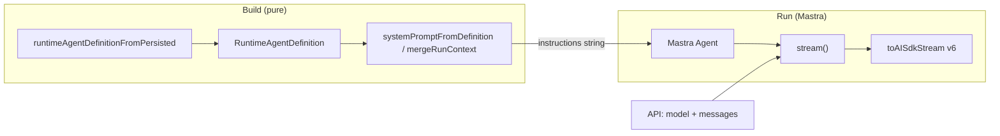

# Agent runtime pattern: build → runtime → stream

This document describes a **maintainable, extensible pattern** for CentrAI’s `@centrai/agent` package: turn persisted or in-memory agent configuration into a **runtime** (today often **Mastra** `Agent` + `stream`), then surface output through the **AI SDK v6** UI stream. The **execution layer is pluggable**: you can swap Mastra for another adapter or a **self-implemented** loop (see [Multi-runtime maintenance](./multi-runtime-maintenance.md#self-implemented-runtime-native--centrai)). It borrows structure from [Agno](https://docs.agno.com/)’s mental model (agents, model, tools, memory, session/storage) without requiring Agno at runtime.

## Goals

- **Build**: Produce a consistent, typed **runtime definition** (identity, instructions, tools as data, session defaults, message policy) independent of any single LLM provider.
- **Run**: Execute a **chat turn** through a **runtime adapter** (e.g. Mastra `Agent.stream` + **`toAISdkStream`**, or your own **native** loop on top of AI SDK `streamText`) and expose the same **`StreamRunResult`** shape for HTTP/SSE and the web UI.
- **Extend**: Add capabilities through small, composable **agent components** (function tools, MCP, optional Mastra memory, injected session state) without rewriting the chat pipeline.
- **Maintain**: Keep **one source of truth** for user-visible chat history (Prisma in the API); use Mastra storage/memory only where it clearly helps (workflows, ops, experiments).

## Concept map (Agno-inspired)

Agno organizes agents around **model**, **instructions**, **tools**, **memory**, **knowledge**, **storage/session**, and **teams/workflows**. CentrAI maps those ideas onto this package and the API as follows:

| Agno-style concern | CentrAI placement | Notes |
| ------------------ | ----------------- | ----- |
| Model | `apps/api` provider layer → AI SDK `LanguageModel` passed into stream params | Resolved per request; injected into Mastra `Agent` as `model`. |
| Instructions / role | `runtimeAgentDefinitionFromPersisted` / `systemPromptFromDefinition` + `buildSystemPrompt` / API `ProviderService.buildInstructions` | Single string becomes Mastra `instructions`. |
| Tools (declarative) | `RuntimeTool` union (`function`, `mcp`, `toolkit`) in `domain/tool-spec.ts` | Stored as JSON on `Agent`; parsed and flattened for execution layers. |
| Tools (executable) | *Target*: Mastra-compatible tool definitions + MCP clients at run time | Bridge from `RuntimeTool` → Mastra `tools` / AI SDK `tool` is the main extension surface. |
| Memory (user facts, recall) | Optional: Mastra `Memory` + `PostgresStore`; or app-level memory services | Chat UI history stays in Prisma; Mastra memory is for scoped thread/resource use when enabled. |
| Session / shared state | `SessionState` + `mergeRunContext` / prompt injection | Request-scoped merge; inject via `# Session state` when `addSessionStateToContext` is true. |
| Storage | `createCentrAiPostgresStore` (`mastra` schema) | Operational storage for Mastra, not the canonical user transcript store. |
| Teams / workflows | Out of scope for this doc | Future: multiple agents or Mastra workflows orchestrated above this layer. |

Agno’s useful pattern for **maintainability** is *separation of declaration vs execution*: configure *what* the agent has (tools, memory flags, instructions), then *run* with a small runtime kernel. This package follows the same split: **`RuntimeAgentDefinition`** (declarative) vs a **thin runtime port** (today implemented as **`createCentrAiChatStream`** on Mastra; tomorrow optionally **`runtime/centrai`** you own end to end).

## Lifecycle: two phases

### Phase 1 — Build (pure, testable)

1. Start from persisted agent rows: **`runtimeAgentDefinitionFromPersisted`** → **`RuntimeAgentDefinition`**, or assemble the object inline for tests.
2. Use **`mergeRunContext`** when you need trimmed history + merged session state for a turn.

From the definition:

- **`systemPromptFromDefinition`** / **`definitionToSystemPromptInput`** produce the system string (including optional session block).
- **`mergeRunContext`** merges **session state** and **message history** policy (trim by turns, append request messages).

Nothing in this phase requires Mastra or network I/O, which keeps unit tests fast and stable.

### Phase 2 — Run (Mastra stream)

1. Resolve **model** and base **instructions** in the API (provider + agent DB row, plus optional session preamble).
2. Convert UI messages to **model messages** (AI SDK).
3. Call **`createCentrAiChatStream`** with `instructions`, `model`, `messages`, and optionally `postgresStore` + **`CentrAiChatMemoryScope`** (`thread`, `resource`).
4. Mastra **`Agent`** runs **`stream(...)`** with `stopWhen: stepCountIs(maxSteps)`.
5. **`toAISdkStream(mastraOutput, { from: 'agent', version: 'v6' })`** yields **`sdkUiStream`** for merging into `createUIMessageStream` in the API.

The API can await **`mastraOutput.text`** and **`mastraOutput.totalUsage`** after the stream for persistence, while the client receives token/tool streaming through the UI stream.

## Stream mode contract

- **Input**: `instructions` (final system string), `model`, `messages` (AI SDK / Mastra message list input).
- **Output**:
  - **`mastraOutput`**: Mastra’s `MastraModelOutput` (e.g. `text`, `totalUsage`, tool/step metadata as Mastra exposes).
  - **`sdkUiStream`**: `ReadableStream` of UI chunks for the frontend.

**Extensibility**: any new streaming concern (reasoning traces, richer tool events) should prefer **Mastra’s native stream** first, then **one adapter** (`toAISdkStream` or a successor) so the API controller stays thin.

## Agent components (extension points)

### 1. Tools (`RuntimeTool`)

- **`function`**: JSON-schema-style parameters; execution must map to AI SDK / Mastra tool handlers (implementation lives alongside the API or worker).
- **`mcp`**: `serverId` or `serverUrl` + optional `toolNames`; runtime attaches an MCP client and exposes selected tools to the model.
- **`toolkit`**: Nested grouping; **`flattenRuntimeTools`** produces a flat list for registration.

**Pattern**: *persist declarative tools → validate with Zod → flatten → compile to executable tools once per request or with caching.* Agno-style “callable factories” for tools can be mirrored with TypeScript functions `(ctx) => Tool[]` that output serializable `RuntimeTool[]` for admin UX where needed.

### 2. MCP

Treat MCP as **transport + catalog**: declarative config in `RuntimeMcpTool`, central **connection lifecycle** (per workspace, sandboxed credentials), and a single place that **projects** MCP tools into Mastra’s tool list. That mirrors Agno’s integration story: MCP is a tool source, not a separate ad hoc stream.

### 3. User memory

Two layers (avoid conflating them):

- **Conversation memory**: messages in the database + `mergeRunContext` / `maxTurnsMessageHistory`. This is what the chat UI trusts.
- **Longitudinal user memory** (facts, preferences): either application services (vectors/DB) summarized into `SessionState`, or Mastra **`Memory`** with **`PostgresStore`** when `thread`/`resource` are explicit — e.g. workflow runners or internal assistants, not as a shadow of the main chat log.

Documenting this split keeps **maintainability**: engineers know where to debug “missing message” vs “forgot a user fact”.

### 4. Session state

`SessionState` is a **JSON-serializable bag**. It is **merged** (definition defaults + per-request override in `mergeRunContext`) and optionally **injected into the system prompt** when `addSessionStateToContext` is true. For Agno-like **shared team state**, the same pattern can be extended with namespaced keys (`team`, `user`, `feature`) without changing Mastra APIs.

## Maintainability principles

1. **Single source of truth for chat transcripts** — Prisma conversation messages; Mastra PG schema is for Mastra-owned features.
2. **Thin transport** — `packages/agent` exports definition helpers + stream factory; HTTP, auth, and persistence remain in `apps/api`.
3. **Typed boundaries** — `RuntimeTool` and `RuntimeAgentDefinition` are the contract between admin config, API, and runtime.
4. **One streaming adapter** — Prefer consolidating AI SDK shape conversion in `createCentrAiChatStream` (and helpers), not scattered across controllers.
5. **Feature flags** — Optional `postgresStore` / memory scopes keep development and CI able to run without Mastra DB init when `disableInit` or env flags are used.

## Current implementation notes (honest baseline)

- **`createCentrAiChatStream`** today wires **instructions, model, messages**, and optional **Mastra Memory**; extending it with **executable tools** derived from `RuntimeAgentDefinition` is the natural next step so DB-configured tools match runtime behavior.
- **`runtimeAgentDefinitionFromPersisted`** / **`RuntimeTool`** are ready when the API compiles agents from DB rows; the **chat controller** path still builds `instructions` via **`ProviderService`** — aligning that path fully with **`mergeRunContext`** and tool compilation is incremental work once tool execution is centralized.

## References

- [Mastra Agent](https://mastra.ai/docs) — `Agent`, `stream`, memory, storage.
- [Agno documentation](https://docs.agno.com/) — conceptual parallels: agents, tools, memory, session/storage, teams.
- [Multi-runtime maintenance](./multi-runtime-maintenance.md) — **`AgentRuntimeAdapter`**, LangChain, and **self-implemented `centrai`** runtime layout.
- Package layout: `packages/agent/src/build/`, `packages/agent/src/domain/`, `packages/agent/src/runtime/`.
