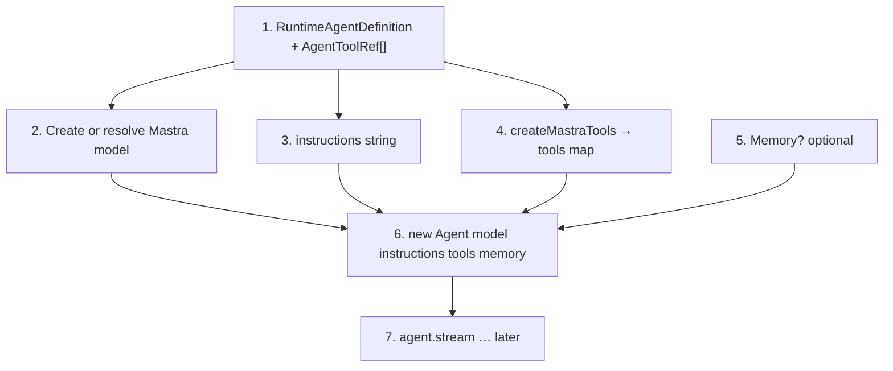
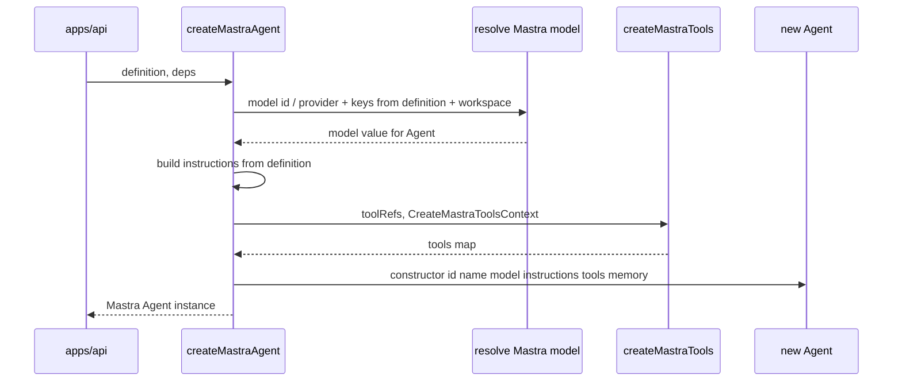
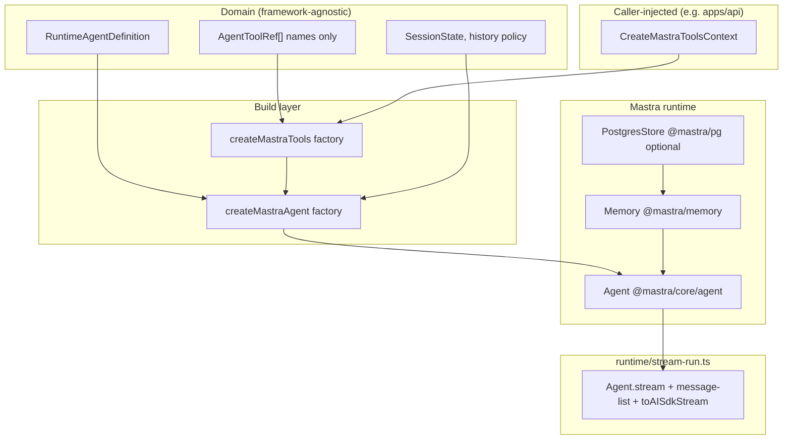
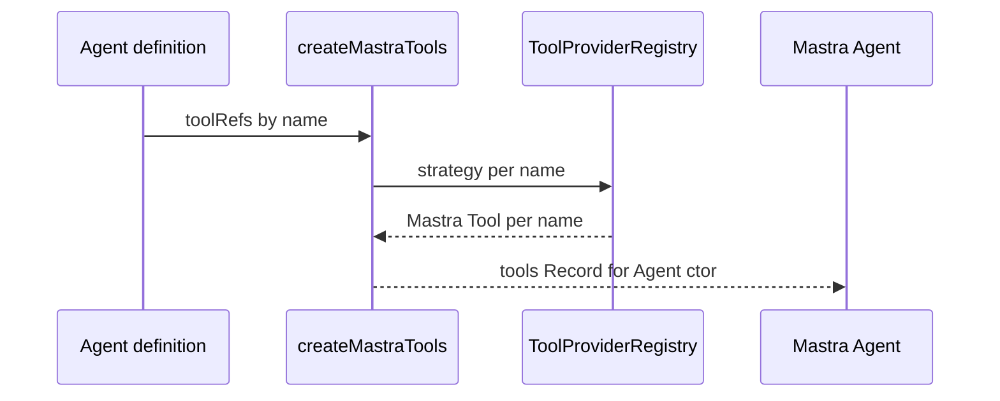
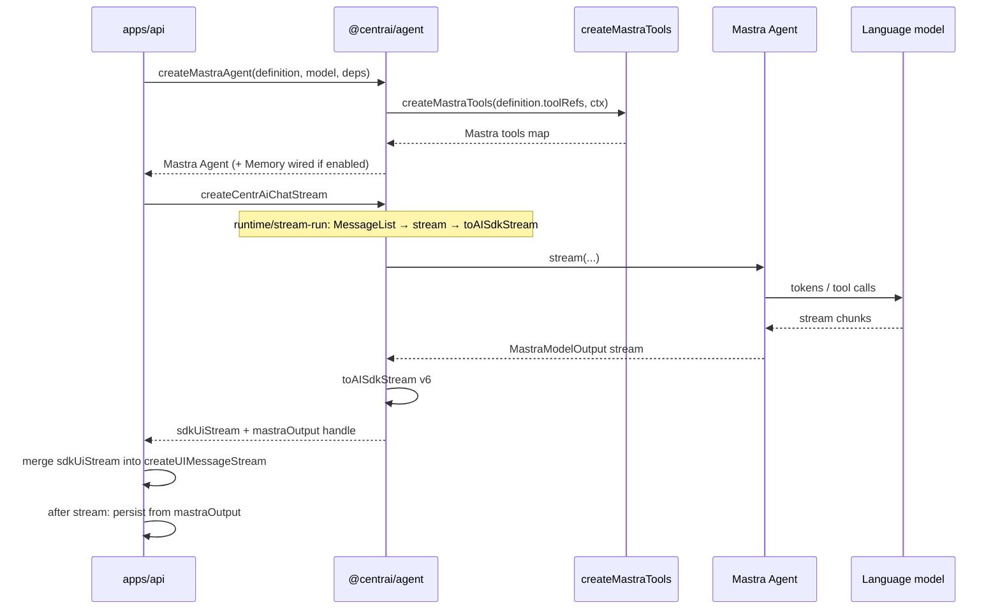
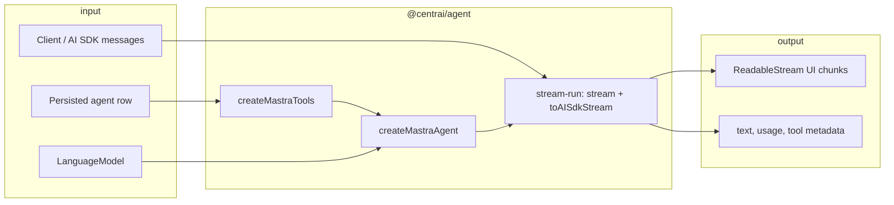
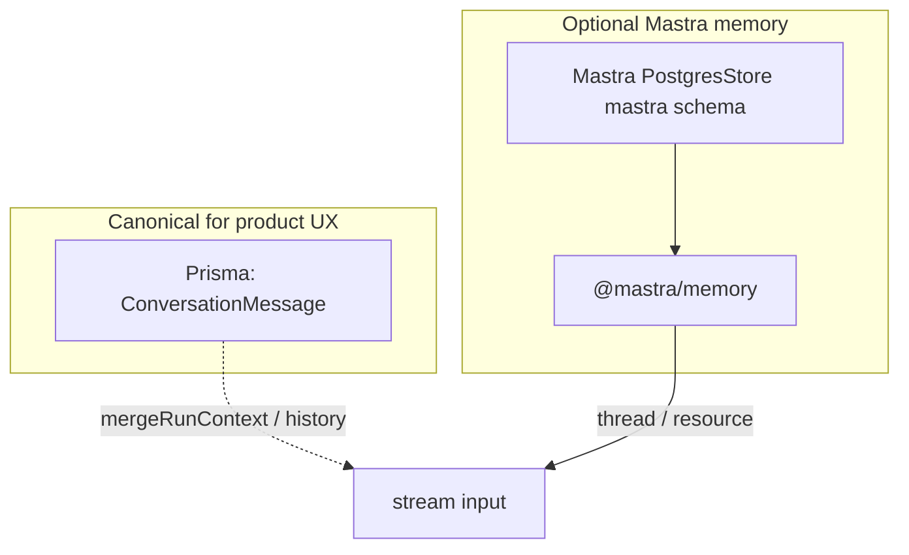

# `@centrai/agent` — target architecture

This document describes the **planned** layout for the package after the Mastra-centric re-implementation. It is **not** a map of today’s files; use it as the blueprint for refactors and new modules.

## Naming (design-pattern vocabulary)

Use these names consistently in code and docs so responsibilities stay obvious.

| Pattern | Component / symbol | Role |
| -------- | ----------------- | ----- |
| **DTO / value object** | `RuntimeAgentDefinition`, `AgentToolRef`, Zod schemas in `domain/` | Persisted or API-carried data; no Mastra imports. |
| **Factory** | `createMastraAgent` | Builds a Mastra `Agent` from a definition + `LanguageModel` + deps (`build/mastra-agent.factory.ts`). |
| **Factory** | `createMastraTools` | Builds the `tools` map from `AgentToolRef[]` + context (`build/mastra-tool.factory.ts`). |
| **Registry + strategy** | `ToolProviderRegistry`, `ToolProvider` | Resolves a single ref by name; registry aggregates strategies (`build/tool-provider.registry.ts`, `build/tool-strategies/`). |
| **Facade + Mastra stream (single file)** | `createCentrAiChatStream` in `runtime/stream-run.ts` | Public entry: **`Agent.stream`**, Mastra **message-list** prep, **`toAISdkStream`** — no separate adapter modules. |
| **Dependency injection** | `MastraAgentFactoryDeps`, `CreateMastraToolsContext` | Model, memory, store, registry injected by the caller—no env reads inside pure factories. |

Legacy or vague names to **avoid** in new code: `generateTools` (use `createMastraTools`), `buildAgent` (use `createMastraAgent`), `mapDefinitionToMastraConfig` (inline into `createMastraAgent` or private `toMastraAgentInput`).

## Scope

| In scope (`@centrai/agent`) | Out of scope (callers, usually `apps/api`) |
| --------------------------- | ------------------------------------------ |
| Declarative agent definition types and validation | HTTP, SSE wiring, auth, rate limits |
| Build: definition → Mastra `Agent` (+ tools, memory hooks) | Resolving `LanguageModel` from workspace secrets / catalog |
| **`createMastraTools` + `ToolProviderRegistry`**: name-only refs → Mastra `Tool` instances | Storing MCP server credentials (workspace DB); factories *consume* resolved config the API passes in |
| Normalize messages via Mastra message-list | Persisting user messages and assistant output to Prisma |
| Run: `Agent.stream` → `toAISdkStream` | `createUIMessageStream` merging and response headers |
| Shared types for stream result (text, usage, errors) | User/workspace RBAC |

---

## Creating a Mastra Agent (step by step)

Use this when implementing **`createMastraAgent`**. Mastra’s `Agent` is constructed from **`@mastra/core/agent`**; CentrAI adds **tool resolution** and **prompt assembly** before `new Agent(...)`.

### Prerequisites (caller supplies)

| Input | Source |
| ----- | ------ |
| Model resolution inputs | `apps/api` — catalog model id / provider, workspace keys, routing; output must satisfy Mastra’s **`model`** field (see step 2). |
| `CreateMastraToolsContext` | Caller — workspace id, **`ToolProviderRegistry`**, MCP clients if needed |
| Optional `PostgresStore` | Only if Mastra **Memory** with PG backend is enabled |

### Steps

1. **Load definition** — `RuntimeAgentDefinition` from DB or tests: identity, **`AgentToolRef[]`**, chosen model id / provider hint, flags (memory mode, limits).
2. **Create or resolve Mastra model** — Turn catalog + credentials into the value **`new Agent({ model })`** expects. In `@mastra/core`, `model` is typed as **`DynamicArgument<MastraModelConfig | …>`**: often a **provider string** (e.g. `'openai/gpt-5'`), a **Mastra / AI SDK language model**, or another **`MastraModelConfig`** shape your version documents. CentrAI typically resolves this in **`apps/api`** and passes the result into **`createMastraAgent`** (see **`runtime/stream-run.ts`** for how `model` is threaded into `Agent` in the chat path).
3. **Instructions** — Merge system prompt + optional session block (`buildSystemPrompt` / `mergeRunContext`) → single **`instructions: string`** for Mastra.
4. **Tools** — `createMastraTools(definition.toolRefs, ctx)` → **`Record<string, MastraTool>`** (or empty). Skip if no tools.
5. **Memory (optional)** — If enabled, `new Memory({ storage: postgresStore, ... })` per `@mastra/memory` and your policy.
6. **Construct agent** — `new Agent({ id, name, model, instructions, tools?, memory?, ... })` using Mastra’s constructor (field names follow Mastra docs).
7. **Run separately** — Streaming is **not** part of construction: call **`agent.stream(messages, { stopWhen, memory?: { thread, resource }, abortSignal })`** then **`toAISdkStream`** (see `runtime/stream-run.ts`).

### Flowchart (build-time)



### Sequence (who calls what)



### Notes

- **`id` / `name`** — Stable ids for Mastra tracing; can default (e.g. `centrai-chat`) or come from the persisted agent row.
- **`model` (step 2)** — Must match **`Agent`’s `model` type** for your `@mastra/core` version (`MastraModelConfig` / **`MastraLanguageModel`** / provider string — see `agent.d.ts` and `llm/model/shared.types`). Resolve **before** `new Agent`; do not confuse with streaming, which happens in step 7.
- **`tools`** — Omit or `{}` when the agent has no tools.
- **`stream` options** — `stopWhen: stepCountIs(n)` aligns with your **`maxSteps`**; memory scopes (`thread`, `resource`) are passed to **`stream`**, not always to the constructor (check Mastra version docs).

---

## 1. Tools: three layers (agent ref → factory → Mastra)

CentrAI separates **what the admin attaches to an agent** (minimal, stable) from **what Mastra runs**. Tool **schemas and `Tool` values** use **Mastra only** (`createTool`, Mastra types)—no parallel spec in `domain/`.

| Layer | Stored / carried | Responsibility |
| ----- | ----------------- | ---------------- |
| **Agent tool ref** | On the agent definition row only | **Identifiers** only (e.g. name / id). |
| **Tool resolution** | `build/` at stream time | **`createMastraTools`**: refs + **`CreateMastraToolsContext`** + **`ToolProviderRegistry`** → Mastra **`Tool`** map via `createTool`. |
| **Mastra execution** | In memory | `Agent` receives Mastra **`tools`** as usual. |

**Why a factory**

- Agent JSON stays small and versionable (names only).
- The same ref can mean “built-in calculator” in CI and “MCP-backed search” in prod, depending on **workspace config** injected at runtime.
- **Async resolution** (MCP connect, capability negotiation) stays behind **`createMastraTools`** so **`createMastraAgent`** stays a thin composition step.

**Suggested interface (conceptual)**

```ts
// MastraTool — the tool type `Agent` accepts (from Mastra `createTool` / `@mastra/core` exports).

// Domain: no Mastra imports
type AgentToolRef = { name: string };

/** Injected by apps/api (not domain). */
type CreateMastraToolsContext = {
  workspaceId: string;
  registry: ToolProviderRegistry;
};

function createMastraTools(
  refs: AgentToolRef[],
  ctx: CreateMastraToolsContext,
): Promise<Record<string, MastraTool>>; // MastraTool = Mastra tool interface from createTool

/** Strategy returns Mastra tools only. */
type ToolProvider = (
  ref: AgentToolRef,
  ctx: CreateMastraToolsContext,
) => Promise<MastraTool> | MastraTool;

type ToolProviderRegistry = Map<string, ToolProvider>;
```

**`ToolProviderRegistry`** — Strategies per tool name; **`createMastraTools`** (factory) dedupes refs, dispatches to the right **`ToolProvider`**, merges into one `tools` object for `new Agent({ tools })`.

---

## 2. Logical components



**Roles**

- **Domain** — Zod-typed agent definition + **`AgentToolRef[]`** only; MCP/catalog wiring in **`CreateMastraToolsContext`** (caller) and **`createMastraTools`** (Mastra `createTool`).
- **`createMastraTools`** — Factory: **refs + context → Mastra `tools` map**.
- **`createMastraAgent`** — Factory: definition + model + **`MastraAgentFactoryDeps`** (tools, optional `Memory`, store).
- **Mastra runtime** — `Agent`, optional memory + store.
- **Chat turn** — **`createCentrAiChatStream`** in **`runtime/stream-run.ts`**: same file calls Mastra **`stream`**, uses **`@mastra/core/agent/message-list`** as needed, then **`toAISdkStream`** for the UI (no separate adapter layer).



---

## 3. Behavior: single chat turn

High-level sequence from API entry to bytes on the wire (conceptual).



**Phases**

1. **Resolve model** in the API (catalog, keys, workspace) and pass an AI SDK–compatible `LanguageModel` into the build step.
2. **Build** with **`createMastraTools`** then **`createMastraAgent`**: name-only refs → tools map → Mastra `Agent` (instructions, memory scope).
3. **Chat turn** in **`runtime/stream-run.ts`**: prepare input with Mastra **message-list** helpers, **`Agent.stream`**, then **`toAISdkStream`** for the UI (same module, no adapter split).
4. **Persist** in the API after or during the stream (usage, assistant text); Prisma remains the source of truth for the visible transcript.

---

## 4. Data flow (one request)



---

## 5. Memory and transcripts (policy)



- **Prisma** — What the chat UI lists and what compliance/debugging use.
- **Mastra Memory + store** — For features that need Mastra’s thread semantics, recall, or workflows; must not silently replace Prisma history unless explicitly designed.

---

## 6. Proposed code structure

Target tree under `packages/agent/src/`. Names are indicative; adjust to taste during implementation.

```text
packages/agent/
  src/
    index.ts                 # Public exports only (Facade + DTOs)

    domain/
      agent-definition.ts    # RuntimeAgentDefinition (DTO), Zod schemas
      agent-tool-ref.ts      # AgentToolRef — names only, attached to agent
      session-state.ts
      message-policy.ts      # max turns, trimming (pure)

    build/
      from-persistence.ts    # DB row → RuntimeAgentDefinition
      mastra-agent.factory.ts    # createMastraAgent — Factory
      mastra-tool.factory.ts     # createMastraTools — Factory
      tool-provider.registry.ts  # createToolProviderRegistry — Registry
      tool-strategies/           # ToolProvider strategies (built-in, MCP, …)
        index.ts

    runtime/
      stream-run.ts            # createCentrAiChatStream — Agent.stream + message-list + toAISdkStream (merged)
      memory.ts                # Optional Memory + PostgresStore helpers (DI)
      errors.ts

    prompts/
      system-prompt.ts       # buildSystemPrompt, session block

  docs/
    README.md
    architecture.md          # this file
    agent-runtime-pattern.md
    ...
```

**Module ↔ pattern**

- **`mastra-tool.factory.ts`** — `createMastraTools`: dedupe refs, dispatch **`ToolProviderRegistry`**, merge `tools` for `Agent`.
- **`tool-strategies/`** — One **strategy** per integration (HTTP tool, MCP projection); registered via **`tool-provider.registry.ts`**.
- **`mastra-agent.factory.ts`** — `createMastraAgent`: composes tools + instructions + optional memory.
- **`runtime/stream-run.ts`** — **`createCentrAiChatStream`**: runs **Mastra `Agent` directly**; inline use of message-list helpers, **`stream`**, **`toAISdkStream`** (facade for the chat turn, not a separate adapter layer).

**Dependency rule of thumb**

- `domain/*` must not import `@mastra/*`.
- `build/*` may import `@mastra/core` (including **`createTool`**), `@mastra/memory`, `@mastra/pg`.
- `runtime/stream-run.ts`, `runtime/memory.ts`, and other Mastra-facing modules under `runtime/` import `@mastra/core`, `@mastra/ai-sdk` (`toAISdkStream`), `ai` as needed.

---

## 7. Public surface (target)

Minimal exports for `apps/api`:

| Export | Pattern | Responsibility |
| ------ | -------- | ---------------- |
| `runtimeAgentDefinitionFromPersisted` | Mapper / DTO | DB → `RuntimeAgentDefinition` (includes **`AgentToolRef[]`**) |
| `buildSystemPrompt` / `mergeRunContext` | Pure helpers | Instructions + history + session block |
| `createCentrAiChatStream` | **Facade** | `createMastraTools` → `createMastraAgent` → **`runtime/stream-run.ts`** (`stream` + `toAISdkStream`) |
| `createMastraAgent`, `createMastraTools` | **Factory** | Optional direct exports for tests or custom pipelines |
| Types | — | `StreamRunResult`, `MastraAgentFactoryDeps`, `CreateMastraToolsContext`, errors |

Everything else can stay internal or be exported for workers and tests.

---

## 8. External dependencies

| Package | Role |
| ------- | ---- |
| `@mastra/core` | `Agent`, message-list, **`createTool`** / tool-spec for executable tools |
| `@mastra/memory` | Optional `Memory` |
| `@mastra/pg` | Optional `PostgresStore` for Mastra |
| `@mastra/ai-sdk` | `toAISdkStream` |
| `ai` | `LanguageModel`, AI SDK message types |
| `zod` | Agent definition validation; tool **`inputSchema`** / params per Mastra `createTool` usage |

---

## 9. Related docs

- [README](./README.md) — Package intent and re-implementation summary
- [Agent runtime pattern](./agent-runtime-pattern.md) — Deeper lifecycle and extension points
